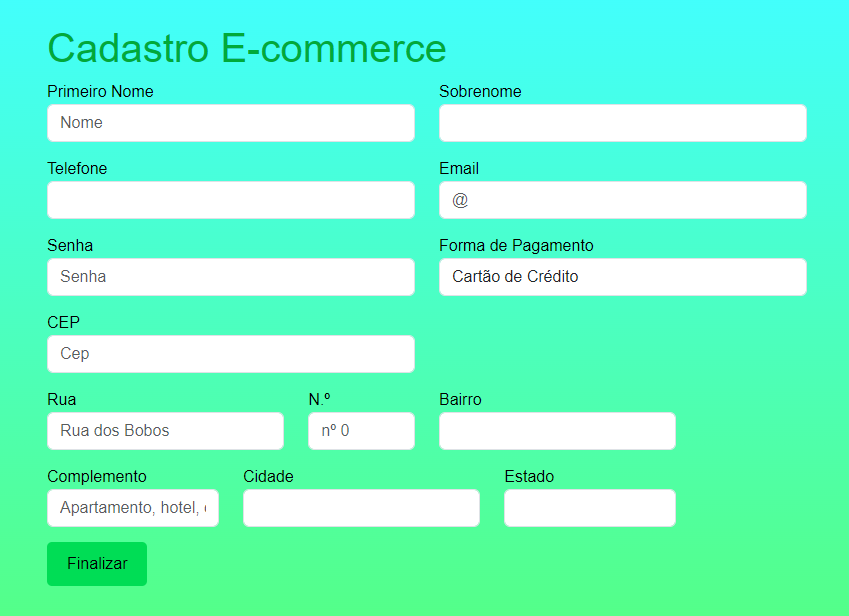

# e-commerce
# Índice
 
[E-commerce]()  
[Introdução](#introdu%C3%A7%C3%A3o)  
[Descrição](#descri%C3%A7%C3%A3o)  
[Tecnologias ultilizadas ](#tecnologias-utilizadas)  
[Funcionalidade](#funcionalidade)  
[Fontes consultadas ](#fontes-consultadas)  
[Autores](#autores)  
 
# E-commerce

 
## Introdução
esse trabalho tem objetivo de fazer um cadstro de usuário para realizar uma compra em um site E-commerce.
 
## Descrição
A intenção do trabalho é pesquisar caracteristicas sobre o site E-commerce e aplicar ao projeto 

## E-commerce 

## Funcionalidade
 
## Fontes consultadas
 
## Autores
Maria Fernanda 